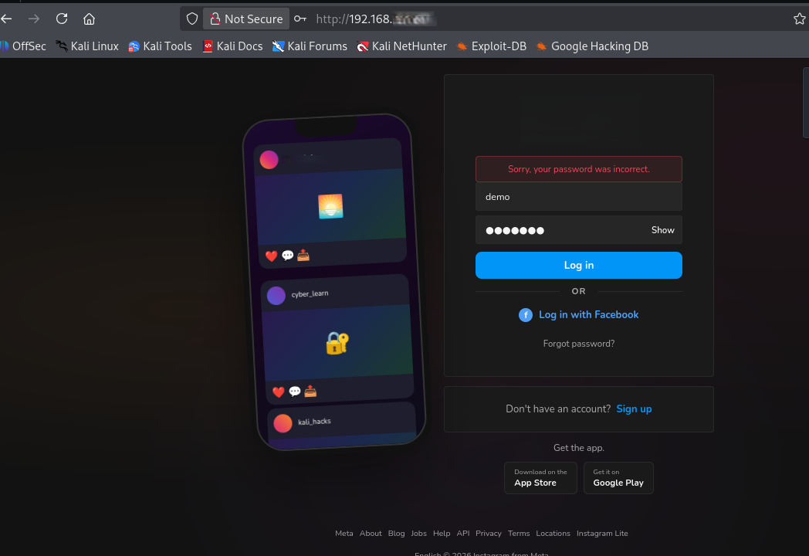
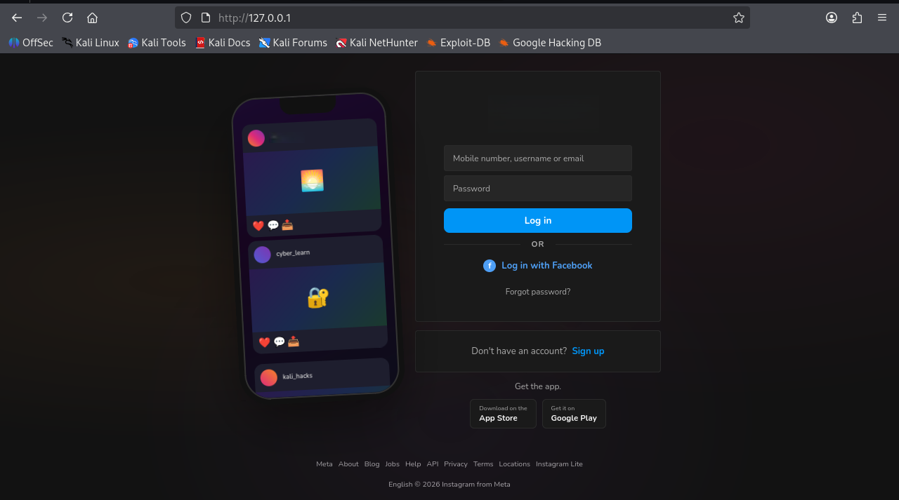
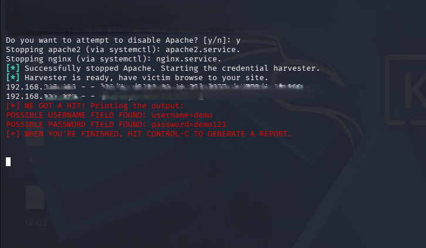

# Phishing Awareness Simulation Platform

Educational phishing simulation project developed to demonstrate how phishing attacks operate in a controlled laboratory environment. The objective of this project is to help students and beginners understand phishing techniques and improve cybersecurity awareness.

---

## Disclaimer

This project is strictly for educational and cybersecurity awareness purposes.

All demonstrations were performed in a controlled lab environment using localhost and sample data. This project must not be used against real users, public systems, or unauthorized targets.

The author does not support malicious phishing activities.

---

## Project Overview

Phishing is one of the most common social engineering attacks used to trick users into revealing sensitive information. This project demonstrates a phishing workflow in a safe environment to help learners understand attacker techniques and recognize phishing attempts.

---

## Features

* Educational phishing simulation
* Controlled lab environment testing
* Login page simulation
* Credential capture demonstration using sample data
* Cybersecurity awareness training
* Beginner-friendly cybersecurity project

---

## Technologies Used

* HTML5
* CSS3
* JavaScript
* Kali Linux
* Apache2 Web Server
* Social Engineering Toolkit (SEToolkit)

---

## Project Workflow

1. Create a phishing simulation page.
2. Host the page in a controlled testing environment.
3. Enter sample credentials for demonstration.
4. Observe how information can be intercepted during a phishing attack.
5. Learn defensive practices and phishing awareness concepts.

---

## Screenshots

### Simulation Page

Phishing simulation interface designed for educational purposes. This page demonstrates how attackers may imitate legitimate login portals to deceive users.

### Localhost Login Page

Locally hosted login simulation running in a controlled testing environment. The page is used to demonstrate phishing techniques safely without targeting real users.

### Capture Demonstration

Terminal output showing a credential capture demonstration using sample data in a controlled laboratory environment. The screenshot is included for educational analysis of phishing workflows and awareness training.

---

## Security Awareness Lessons

This project highlights the importance of:

* Verifying URLs before entering credentials
* Avoiding suspicious links and emails
* Using Multi-Factor Authentication (MFA)
* Checking website authenticity
* Following cybersecurity best practices
* Understanding common social engineering tactics

---

## Educational Purpose

The goal of this project is to help students understand phishing attacks from a defensive and awareness perspective. By learning how phishing works, users can better identify and avoid real-world phishing attempts.

---

## License

This project is licensed under the MIT License.
